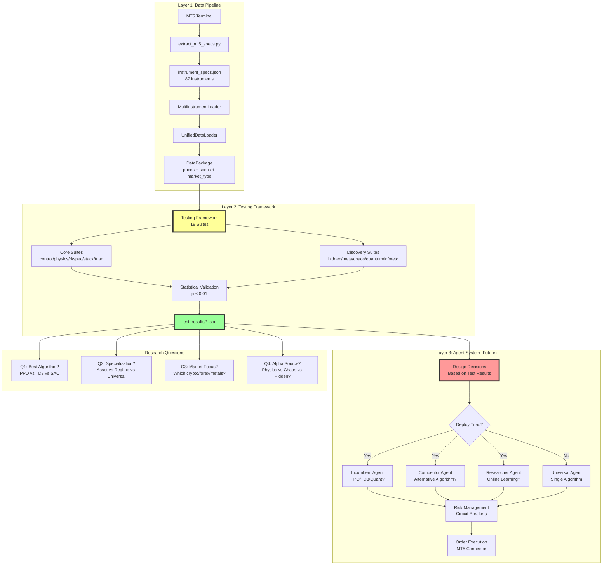

# Kinetra Complete Architecture
## Research-First Testing Framework → Alpha Discovery → Production Deployment

**Last Updated**: 2026-01-01  
**Status**: Research & Tooling Setup Phase (Pre-Production)

---

## 🎯 Executive Summary

**Current State**: Building research tooling and testing framework  
**Goal**: Discover alpha through systematic testing, then design production system  
**Philosophy**: "We don't know what gives us alpha yet - let the data tell us"

### Critical Path
```
Data Collection → Data Preparation → Testing Framework → Alpha Discovery → System Design
         ↓               ↓                  ↓                    ↓              ↓
    87 datasets      Clean/Split      18 test suites      Answer questions   Build winners
```

---

## 📋 Open Research Questions (To Be Answered by Testing Framework)

### 1. **Agent Architecture**
- **Triad System**: Incumbent (PPO) vs Competitor (TD3) vs Researcher (SAC/Quant)?
  - Or all same algorithm with different tuning?
  - Or completely different approaches?

### 2. **Specialization Strategy**
- **By Asset Class**: One agent per market type (crypto/forex/metals)?
- **By Timeframe**: One agent per timeframe (M15/H1/H4)?
- **By Regime**: One agent per physics regime (laminar/chaotic)?
- **By Strategy**: Different hunting styles (sniper/berserker/trend)?
- **Universal**: One agent learns everything?

### 3. **Market Focus**
- **Which crypto pairs** to trade?
- **Which forex majors**?
- **Which indices**?
- Portfolio concentration vs diversification?

### 4. **Alpha Sources**
- What measurements correlate with alpha?
- Portfolio-level metrics?
- Instrument-class metrics?
- Individual instrument metrics?
- Cross-instrument relationships?

---

## 🏗️ System Architecture (3 Layers)

### Layer 1: Data Pipeline (IMPLEMENTED ✅)

```
MT5 Terminal (Live Data)
    ↓
extract_mt5_specs.py → instrument_specs.json (87 instruments)
    ↓
MultiInstrumentLoader (Auto-discovery)
    ↓
UnifiedDataLoader (Market-specific preprocessing)
    ↓
DataPackage (Standardized container)
    ↓
Testing Framework / Backtest Engine
```

**Status**: 
- ✅ 87 datasets discovered (crypto, forex, metals, energy, indices)
- ✅ Auto-detection 100% accurate
- ✅ Real MT5 specs loaded (swaps, margins, spreads)
- ✅ Market-specific preprocessing (forex weekend removal, crypto 24/7)

### Layer 2: Testing & Exploration Framework (IN PROGRESS 🔄)

```
┌─────────────────────────────────────────────────────────────────┐
│                  TESTING FRAMEWORK (18 Suites)                   │
├─────────────────────────────────────────────────────────────────┤
│                                                                   │
│  Core Suites (6):                                                │
│  ├─ control        (MA, RSI, MACD baseline)                      │
│  ├─ physics        (Energy, damping, entropy)                    │
│  ├─ rl             (PPO, SAC, A2C, TD3)                          │
│  ├─ specialization (Asset/Timeframe/Regime)                      │
│  ├─ stacking       (Ensemble methods)                            │
│  └─ triad          (Incumbent/Competitor/Researcher)             │
│                                                                   │
│  Discovery Suites (12):                                          │
│  ├─ hidden         (PCA, ICA, autoencoders)                      │
│  ├─ meta           (MAML meta-learning)                          │
│  ├─ cross_regime   (Regime transitions)                          │
│  ├─ cross_asset    (Transfer learning)                           │
│  ├─ mtf            (Multi-timeframe fusion)                      │
│  ├─ emergent       (Evolution strategies)                        │
│  ├─ adversarial    (GAN-style validation)                        │
│  ├─ quantum        (Strategy superposition)                      │
│  ├─ chaos          (Lyapunov, attractors)                        │
│  ├─ info_theory    (Mutual info, causality)                      │
│  ├─ combinatorial  (Feature combinations)                        │
│  └─ deep_ensemble  (Stack everything)                            │
│                                                                   │
│  Statistical Validation:                                         │
│  └─ p < 0.01, Bonferroni/FDR correction, Effect sizes           │
└─────────────────────────────────────────────────────────────────┘
```

**Entry Points**:
```bash
# Quick validation (10 min)
python scripts/testing/unified_test_framework.py --quick

# Specific suite
python scripts/testing/unified_test_framework.py --suite chaos

# Compare approaches
python scripts/testing/unified_test_framework.py --compare control physics rl

# Full exploration (hours/days)
python scripts/testing/unified_test_framework.py --extreme
```

**Integration Plumbing Needed** (Priority):
1. Connect `kinetra/testing_framework.py` to RL training loops
2. Wire up discovery methods (hidden dimensions, chaos theory, etc.)
3. Integrate with physics engine for regime detection
4. Connect to risk management for validation
5. Output alpha metrics to answer research questions

### Layer 3: Agent System (DESIGNED, NOT DEPLOYED ⚠️)

```
┌────────────────────────────────────────────────────────────────┐
│                    TRIAD SYSTEM (PER SPECIALIST)                │
├────────────────────────────────────────────────────────────────┤
│                                                                  │
│  ┌─────────────┐   ┌─────────────┐   ┌─────────────┐          │
│  │  INCUMBENT  │   │ COMPETITOR  │   │ RESEARCHER  │          │
│  │   (Live)    │   │  (Shadow A) │   │  (Shadow B) │          │
│  │             │   │             │   │             │          │
│  │ PPO/TD3/    │   │ Alternative │   │ Online      │          │
│  │ Quant?      │   │ Algorithm?  │   │ Learning?   │          │
│  │             │   │             │   │             │          │
│  │ [Frozen]    │   │ [Frozen]    │   │ [Training]  │          │
│  └─────────────┘   └─────────────┘   └─────────────┘          │
│        │                  │                  │                  │
│        └──────────────────┴──────────────────┘                  │
│                           │                                     │
│                    Promotion Logic                              │
│          (Shadow B → Incumbent if Sharpe > 0.3)                 │
└────────────────────────────────────────────────────────────────┘
```

**Questions to Answer**:
- Do we need triads at all?
- What algorithm for each role?
- How many specialists (asset class? regime? strategy type?)?

---

## 🔄 Complete Data Flow

### Phase 1: Data Collection (DONE ✅)

```
MT5 Terminal
    ↓
scripts/download/*.py
    ↓
data/master/*.csv (87 files)
    ↓
instrument_specs.json (Real broker data)
```

### Phase 2: Data Preparation (DONE ✅)

```
UnifiedDataLoader.load()
    ↓
Market-specific preprocessing:
- Forex: Remove weekends
- Crypto: Keep 24/7
- Validate OHLCV integrity
    ↓
DataPackage:
- prices (OHLCV)
- symbol_spec (MT5 data)
- market_type (auto-detected)
- quality_report
```

### Phase 3: Testing Framework (PRIORITY 🔥)

```
DataPackage
    ↓
testing_framework.py
    ↓
Run 18 test suites
    ↓
Statistical validation (p < 0.01)
    ↓
Results → test_results/*.json
    ↓
Alpha discovery answers
```

**Critical Integration**:
```python
# Current gap: Testing framework → RL agents not connected

# Needed:
from kinetra.testing_framework import TestConfiguration, run_test_suite
from kinetra.rl_agent import KinetraAgent  # PPO
from kinetra.triad_system import IncumbentAgent, CompetitorAgent, ResearcherAgent

# Wire up:
test_config = TestConfiguration(
    name="triad_comparison",
    instruments=[...],
    agent_type='triad',
    agent_config={
        'incumbent': IncumbentAgent(algorithm='PPO'),
        'competitor': CompetitorAgent(algorithm='TD3'),
        'researcher': ResearcherAgent(algorithm='SAC'),
    }
)

results = run_test_suite(test_config)
# → Answers: Which algorithm wins? Which specialization works?
```

### Phase 4: Outcome Analysis (NEXT STEP)

```
Test Results
    ↓
Statistical Analysis:
- Which suite has highest Omega ratio?
- Which specialization most consistent?
- Which features correlate with alpha?
    ↓
Decision Matrix:
┌─────────────────────┬──────────┬──────────┬──────────┐
│ Question            │ Suite    │ Metric   │ Answer   │
├─────────────────────┼──────────┼──────────┼──────────┤
│ Best algorithm?     │ rl       │ Sharpe   │ ???      │
│ Specialization?     │ spec     │ Robust   │ ???      │
│ Market focus?       │ control  │ Omega    │ ???      │
│ Alpha source?       │ physics  │ p-value  │ ???      │
└─────────────────────┴──────────┴──────────┴──────────┘
```

---

## 📊 Agent Classes (Available, Not Deployed)

### Implemented Agents

| Agent Type | File | Algorithm | Status |
|------------|------|-----------|--------|
| **KinetraAgent** | `rl_agent.py` | PPO | ✅ Implemented |
| **NeuralAgent** | `rl_neural_agent.py` | DQN | ✅ Implemented |
| **LinearQAgent** | `rl_exploration_framework.py` | Linear Q | ✅ Implemented |
| **IncumbentAgent** | `triad_system.py` | Configurable | ✅ Implemented |
| **CompetitorAgent** | `triad_system.py` | Configurable | ✅ Implemented |
| **ResearcherAgent** | `triad_system.py` | Configurable | ✅ Implemented |
| **ShadowAgent** | `doppelganger_triad.py` | Wrapper | ✅ Implemented |

### Agent Wrappers

| Wrapper | File | Purpose | Status |
|---------|------|---------|--------|
| **DoppelgangerTriad** | `doppelganger_triad.py` | Live + Shadow A + Shadow B | ✅ Implemented |
| **SpecialistAgents** | `specialist_agents.py` | Asset class specialists | ✅ Implemented |
| **TriplegangerSystem** | `tripleganger_system.py` | Risk management + circuit breakers | ✅ Implemented |

---

## 🧪 Testing Scripts (Entry Points)

### Main Testing Interface

```bash
# Unified framework (recommended)
python scripts/testing/unified_test_framework.py --quick
python scripts/testing/unified_test_framework.py --full
python scripts/testing/unified_test_framework.py --extreme

# Specific suites
python scripts/testing/unified_test_framework.py --suite control
python scripts/testing/unified_test_framework.py --suite physics
python scripts/testing/unified_test_framework.py --suite triad

# Compare
python scripts/testing/unified_test_framework.py --compare control physics rl
```

### Specialized Exploration

```bash
# Specialization strategy explorer
python scripts/training/explore_specialization.py

# Universal vs specialist comparison
python scripts/training/explore_universal.py
python scripts/training/explore_compare_agents.py

# Triad system training
python scripts/training/train_triad.py

# Interactive exploration
python scripts/training/explore_interactive.py
```

### Backtesting

```bash
# Physics-based backtest
python scripts/testing/run_physics_backtest.py

# Comprehensive backtest with Monte Carlo
python scripts/testing/run_comprehensive_backtest.py

# RL agent backtest
python scripts/testing/rl_backtest.py
```

---

## 🔌 Integration Points (Plumbing Needed)

### 1. Testing Framework ↔ RL Training Loop

**Current State**: Separate codebases  
**Needed**: 
```python
# In testing_framework.py, add:
def run_rl_test_suite(agent_class, config):
    """Train RL agent on test instruments, measure alpha."""
    env = create_multi_instrument_env(config.instruments)
    agent = agent_class(state_dim=64, action_dim=4)
    
    for episode in range(config.episodes):
        agent.train(env)
    
    metrics = evaluate_agent(agent, env)
    return metrics
```

### 2. Physics Engine ↔ Testing Framework

**Current State**: Physics features computed separately  
**Needed**:
```python
# Wire physics_engine directly into test environments
from kinetra.physics_engine import PhysicsEngine

env.physics_engine = PhysicsEngine()
state = env.physics_engine.compute_state(ohlcv)
regime = env.physics_engine.classify_regime(state)
```

### 3. Data Pipeline ↔ Exploration Scripts

**Current State**: Manual file loading  
**Needed**:
```python
# Use UnifiedDataLoader in all exploration scripts
from kinetra.data_loader import UnifiedDataLoader

loader = UnifiedDataLoader(validate=True)
instruments = loader.discover_instruments("data/master/")
for symbol in instruments:
    pkg = loader.load(symbol)
    # Auto-loaded: prices, specs, market_type
```

### 4. Risk Management ↔ Live Trading (FUTURE)

**Current State**: Not applicable (research phase)  
**Future**:
```python
# When deploying to live:
from kinetra.tripleganger_system import TradingMode, ModeConfig

config = ModeConfig.live()  # Hard gates, strict limits
risk_manager = TriplegangerRiskManager(mode=config)
```

---

## 🎯 Development Priorities (Q1 2026)

### Priority 1: Testing Framework Integration (CRITICAL 🔥)

**Goal**: Get testing framework running end-to-end

**Tasks**:
1. ✅ Data pipeline (DONE)
2. 🔄 Wire testing_framework.py to RL agents
3. 🔄 Implement discovery methods (chaos, hidden dims, etc.)
4. 🔄 Statistical validation pipeline
5. 🔄 Results analysis dashboard

**Estimated Time**: 2-3 weeks  
**Blocker**: None (all dependencies exist)

### Priority 2: Answer Research Questions

**Goal**: Discover alpha sources and optimal architecture

**Questions to Answer** (via testing framework):
1. Which RL algorithm performs best? (PPO vs TD3 vs SAC vs Quant)
2. What specialization strategy wins? (Asset class vs regime vs universal)
3. Which instruments show alpha? (Crypto? Forex? Metals?)
4. What measurements predict alpha? (Physics? Volume? Chaos?)
5. Do we need triad system? (Incumbent/Competitor/Researcher)

**Deliverable**: JSON report with statistical significance

**Estimated Time**: 4-6 weeks (after Priority 1)

### Priority 3: Production System Design

**Goal**: Build production architecture based on test results

**Tasks** (contingent on Priority 2 results):
- If triad wins → Implement full tripleganger system
- If universal wins → Deploy single agent
- If physics alpha → Emphasize regime detection
- If chaos alpha → Add nonlinear features

**Estimated Time**: 8-12 weeks (after Priority 2)

### Priority 4: Live Deployment (FUTURE)

**Goal**: Paper trading → Live trading

**Prerequisites**:
- Proven alpha (Omega > 2.7, p < 0.01)
- Risk management validated
- Circuit breakers tested
- Monitoring infrastructure ready

**Estimated Time**: Q2-Q3 2026

---

## 📁 Key Files & Their Roles

### Core Framework

| File | Purpose | Status |
|------|---------|--------|
| `kinetra/testing_framework.py` | Main testing engine | ✅ Core done, needs integration |
| `kinetra/data_loader.py` | Data loading & validation | ✅ Complete |
| `kinetra/data_package.py` | Standardized data container | ✅ Complete |
| `kinetra/physics_engine.py` | Physics state computation | ✅ Complete |
| `kinetra/backtest_engine.py` | Monte Carlo backtesting | ✅ Complete |

### Agent Implementations

| File | Purpose | Status |
|------|---------|--------|
| `kinetra/rl_agent.py` | PPO agent | ✅ Complete |
| `kinetra/rl_neural_agent.py` | DQN agent | ✅ Complete |
| `kinetra/triad_system.py` | Incumbent/Competitor/Researcher | ✅ Complete |
| `kinetra/doppelganger_triad.py` | Shadow agent system | ✅ Complete |
| `specialist_agents.py` | Asset class specialists | ✅ Complete |

### Exploration Scripts

| File | Purpose | Status |
|------|---------|--------|
| `scripts/testing/unified_test_framework.py` | Main test interface | ⚠️ Needs integration plumbing |
| `scripts/training/explore_specialization.py` | Specialization comparison | ✅ Standalone ready |
| `scripts/training/train_triad.py` | Triad training | ✅ Standalone ready |
| `rl_exploration_framework.py` | Multi-instrument RL env | ✅ Complete |

### Workflow Orchestration

| File | Purpose | Status |
|------|---------|--------|
| `scripts/master_workflow.py` | End-to-end workflow | ✅ Data collection done |
| `kinetra/workflow_manager.py` | Atomic ops, logging | ✅ Complete |

---

## 🔍 Measurement Framework

### Metrics Hierarchy

```
Portfolio Level
├─ Sharpe Ratio (risk-adjusted return)
├─ Omega Ratio (probability-weighted gains/losses)
├─ Calmar Ratio (return / max drawdown)
└─ Composite Health Score (0-100)

Instrument Class Level
├─ Per-asset Sharpe
├─ Correlation matrix
├─ Regime breakdown (% in laminar/chaotic)
└─ Edge robustness (consistency across instruments)

Individual Instrument Level
├─ Win rate
├─ Profit factor
├─ MFE/MAE captured
└─ Trade efficiency (Pythagorean distance)

Physics Level
├─ Energy captured (%)
├─ Regime classification accuracy
├─ Damping/entropy correlation with PnL
└─ Chaos indicators (Lyapunov, entropy)
```

### Alpha Sources to Test

**Category 1: Traditional** (control group)
- Moving averages crossovers
- RSI divergences
- MACD signals
- Bollinger Band bounces

**Category 2: Physics** (first principles)
- Energy regime transitions (underdamped → laminar)
- Damping coefficient thresholds
- Entropy collapse (order from chaos)
- Viscosity extremes (liquidity events)

**Category 3: Advanced** (discovery)
- Hidden dimensions (PCA/ICA)
- Chaos theory (Lyapunov exponents)
- Information theory (mutual information)
- Quantum-inspired (strategy superposition)

---

## 🚨 Risk Management (For Future Live Trading)

### Trading Modes

| Mode | Circuit Breakers | Position Limits | Drawdown Limits | Use Case |
|------|------------------|-----------------|-----------------|----------|
| **EXPLORATION** | ❌ Off | ❌ Off | ❌ Off | Backtesting, learn all patterns |
| **PAPER** | ✅ Soft | ✅ Soft | ✅ Soft | Paper trading, warnings only |
| **LIVE** | ✅ Hard | ✅ Hard | ✅ Hard | Live trading, strict protection |

### Adaptive Thresholds (No Magic Numbers)

All thresholds calculated dynamically:
```python
# Percentile-based
threshold = np.percentile(rolling_history, 95)

# Z-score based
threshold = mean + 2.0 * std

# Regime-aware
threshold = regime_specific_percentile(regime, rolling_history)
```

---

## 🔧 Technical Stack

### Data & Computation
- **Data Format**: CSV (OHLCV + volume)
- **Data Storage**: `data/master/` (87 instruments)
- **Specs Storage**: `instrument_specs.json` (real MT5 data)
- **Validation**: Pydantic schemas
- **Numerical Safety**: NaN shields, Kahan summation, epsilon comparisons

### ML/RL
- **Frameworks**: PyTorch (GPU), NumPy (CPU)
- **Algorithms**: PPO, SAC, A2C, TD3, DQN, Linear Q
- **GPU Support**: ROCm (AMD), CUDA (NVIDIA)
- **Physics**: Custom physics engine (energy, damping, entropy)

### Testing & Validation
- **Statistical Tests**: p-value < 0.01, Bonferroni/FDR correction
- **Effect Sizes**: Cohen's d
- **Monte Carlo**: 100+ runs per test
- **Cross-Validation**: Out-of-sample validation

### Persistence & Safety
- **Atomic Saves**: `persistence_manager.py` (crash-safe writes)
- **Backups**: Automated 10-rotation backup system
- **Integrity**: File checksums, tampering detection
- **Logging**: Comprehensive audit trail

---

## 📈 Success Metrics

### Research Phase (Current)

| Metric | Target | Purpose |
|--------|--------|---------|
| **Test Coverage** | 18/18 suites | Comprehensive exploration |
| **Statistical Significance** | p < 0.01 | Real edge, not noise |
| **Effect Size** | Cohen's d > 0.5 | Practical significance |
| **GPU Utilization** | > 80% | Efficient computation |

### Alpha Discovery (Next)

| Metric | Target | Purpose |
|--------|--------|---------|
| **Omega Ratio** | > 2.7 | Asymmetric returns |
| **Sharpe Ratio** | > 1.5 | Risk-adjusted performance |
| **Win Rate** | > 55% | Consistent edge |
| **Consistency** | < 0.2 | Robust across instruments |

### Production (Future)

| Metric | Target | Purpose |
|--------|--------|---------|
| **Composite Health Score** | > 0.90 | System stability |
| **% Energy Captured** | > 65% | Physics alignment |
| **% MFE Captured** | > 60% | Execution quality |
| **Max Drawdown** | < 15% | Capital preservation |

---

## 🎓 Key Design Principles

### 1. First Principles, Zero Assumptions
- **No magic numbers**: All thresholds adaptive (rolling percentiles)
- **No linearity assumptions**: Test for and enforce non-linearity
- **No fixed periods**: Everything adapts to regime
- **Question everything**: Even "best practices" are hypotheses

### 2. Let the Data Speak
- Testing framework answers questions, not assumptions
- Statistical validation filters noise (p < 0.01)
- Multiple testing correction (Bonferroni/FDR)
- Effect sizes for practical significance

### 3. Defense in Depth
- **Layer 1**: Unit tests (100% coverage)
- **Layer 2**: Integration tests (end-to-end)
- **Layer 3**: Monte Carlo backtests (100+ runs)
- **Layer 4**: Statistical validation (p < 0.01)
- **Layer 5**: Health monitoring (real-time)

### 4. Exploration vs Exploitation
- **Research mode**: Open, no gates, learn all patterns
- **Paper mode**: Soft gates, warnings
- **Live mode**: Hard gates, strict protection

---

## 📞 Next Steps (Actionable)

### Immediate (This Week)

1. **Run baseline tests**:
   ```bash
   python scripts/testing/unified_test_framework.py --quick
   ```

2. **Check data integrity**:
   ```bash
   python scripts/testing/test_framework_integration.py
   ```

3. **Verify GPU availability**:
   ```bash
   python scripts/setup/check_gpu.py
   ```

### Short Term (Next 2 Weeks)

4. **Wire testing framework to RL agents** (critical integration)

5. **Run full test suite**:
   ```bash
   python scripts/testing/unified_test_framework.py --full
   ```

6. **Analyze results**: Which suites show promise?

### Medium Term (Next Month)

7. **Implement winning strategies** based on test results

8. **Cross-validate** with out-of-sample data

9. **Document alpha sources** in formal report

### Long Term (Q1-Q2 2026)

10. **Design production architecture** based on discoveries

11. **Build monitoring infrastructure**

12. **Paper trading** with real-time data

---

## 🗺️ Architecture Diagram (Mermaid)



---

## 📚 References

### Internal Documentation
- [Testing Framework Guide](TESTING_FRAMEWORK.md)
- [Specialization Explorer](../scripts/README_SPECIALIZATION_EXPLORER.md)
- [Scientific Testing Guide](SCIENTIFIC_TESTING_GUIDE.md)
- [Branching Strategy](BRANCHING_STRATEGY.md)

### External Research
- Sutton & Barto: Reinforcement Learning
- Statistical Mechanics and Thermodynamics
- Modern Portfolio Theory
- Chaos Theory in Markets

---

**END OF ARCHITECTURE DOCUMENT**

*This document reflects the current state (research phase) and will evolve as testing framework answers open questions.*
